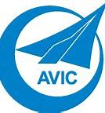
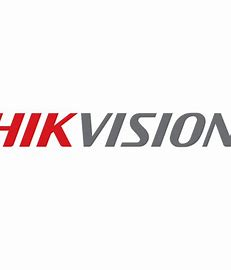

Education
======
---

* B.S. Electronic Engineering, Xidian University, 2021
    * GPA 3.6/4.0

Work&Research experience
======
---

* 2022.11-2023.9 : _
  _Research Assistant__
    * __Microsoft - Microsoft Research Asia - Machine Learning Group__
    * __Contribution__: During my time at Microsoft Research Asia, I was solely responsible for a research project. The
      purpose of this project was to use reinforcement learning and graph neural networks to solve a
      complex combinatorial optimization problem - the Flexible Job Shop Scheduling Problem (FJSP). I
      built a simulator to simulate the process of solving this problem and proposed a method that
      combines generative (Learning to Generate) and improvement (Learning to Improve) approaches to
      achieve better results than other methods in the literature. This work is currently being submitted to the
      ICLR2024, and the
      code for the related work has been uploaded to my Github homepage.
    * __Mentor
      __: [Dr. Song Lei](https://www.microsoft.com/en-us/research/people/lesong/),[Dr. Weidong Ma](https://scholar.google.com/citations?user=d0p1mp4AAAAJ&hl=en)

---

* 2022.11-2023.9 : _
  _Research Intern__
    * __BaiDu Research - PARL Group__
    * __Contribution__: During my time at Baidu, I am responsible for participating in the development and maintenance
      of [PARL](https://github.com/PaddlePaddle/PARL), an open source reinforcement learning framework.
    * __Mentor
      __:Bo Zhou

---

* 2022.4-2022.9: __Research
  Assistant__
    * __Aviation Industry Corporation of China (AVIC) - China Aviation Research__
    * __Contribution__: Designed and developed a reinforcement learning-based stall recovery control system for large
      aircraft (Boeing 737-800). 
      Designed and developed a reinforcement learning-based spin recovery control system for fighter
      jets (F-16). 
      During the project, two optimization methods were proposed to make the model performance
      surpass traditional control methods: 
      -Two-stage reward function model fusion 
      -Action value exponential filtering
    * __Mentor__: [Prof. Junqiu Wang](https://ieeexplore.ieee.org/author/37086326380)

---

* 2021.4-2021.7: __Research
  Intern__
    * __Hikvision Research Institute__
    * __Contribution__: During my internship, I built a reinforcement learning-based robotic arm control system. The
      purpose of this system is to use a deep reinforcement learning network to control a seven-degree-of freedom
      robotic arm to automatically search for negative class samples required by the target model.
    * __Mentor__: Ying Bian

Skills
======

* Python
* C++
* Matlab
* JavaScripts

